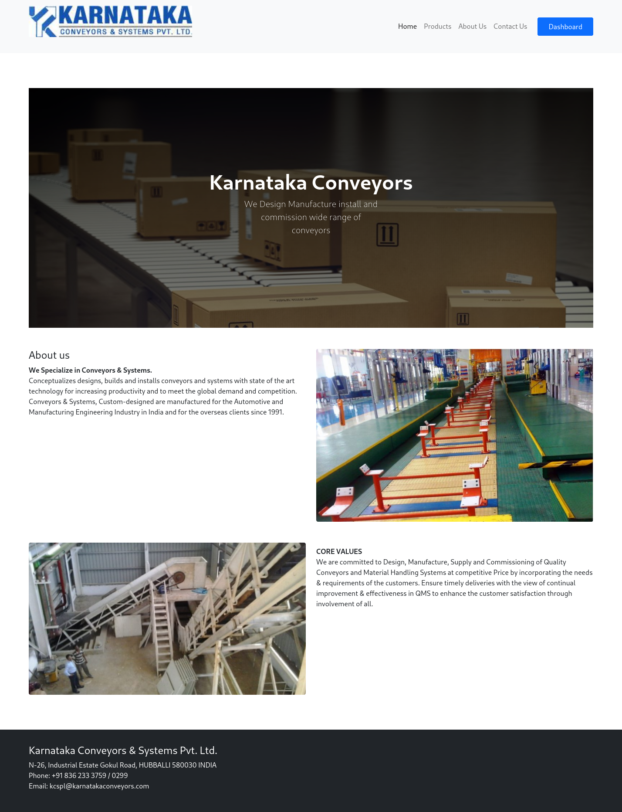
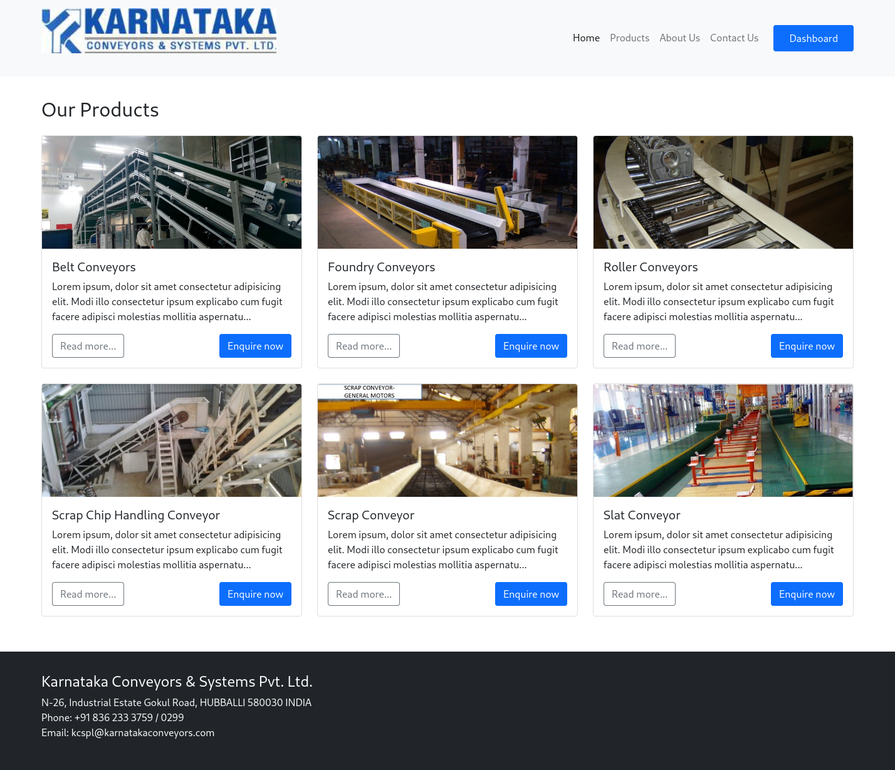
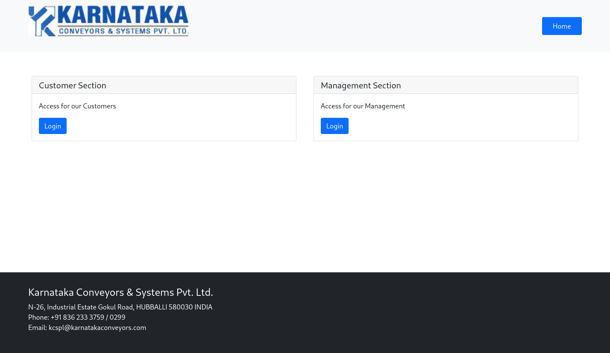

# Conveyor project

**About**

PHP framework [laravel](https://laravel.com/) based project

<br>

**Tools** required to build and run the project.

Basic:

* [Git](https://git-scm.com/) for version control

Tools:

* Apache, PHP & MySQL using [XAMPP](https://www.apachefriends.org/download.html) or [WAMP](http://www.wampserver.com/en/download/)
* [Composer](https://getcomposer.org/) for managing dependencies
* [nodejs](https://nodejs.org/) for building the frontend and assets

or simply

* [docker](https://www.docker.com/) & [docker-compose](https://docs.docker.com/compose/) for running everything in a closed env

<br>

## Installation

**Get the source**

```bash
# cd to folder where you want to clone the project
$ cd /path/to/directory

# Get Source Code
$ git clone https://github.com/sujaykumarh-projects/convoyer-project.git
```
**Setting Up**

* for non docker environment

    ```bash
    # cd to source
    $ cd convoyer-project/src

    # Copy env file
    $ cp .env.example .env

    # Install dependencies
    $ composer install

    # Install NPM packages
    $ npm install
    ```

* for docker on linux

    ```bash
    # cd to source
    $ cd convoyer-project

    # run setup script
    $ sh init.sh

    # edit env file
    $ nano .env

    # run docker containers
    $ docker-compose up -d
    ```

<br>

## Configuration

**Database configuration**

Modify the `src/.env` file with your database credentials.

```env
...

##
# Database Config
##
DB_CONNECTION=mysql
DB_HOST=localhost
DB_PORT=3306
DB_DATABASE=conveyor
DB_USERNAME=conveyor
DB_PASSWORD=conveyor

...
```

## Running the project

* non docker env

    **database operations**

    ```bash
    # run migration
    $ php artisan migrate:fresh --seed
    ```

    **build assets & run operations**

    ```bash
    # bulid assets
    $ npm run dev

    # run server
    $ php artisan serve
    ```

* docker env

    ```bash
    # TODO: add docker instructions
    $ 
    ```

<br>

## Routes

**home routes**

* Homepage: `localhost:PORT/`
* Products: `localhost:PORT/products`
* Product Detail: `localhost:PORT/product/{product_id}`
* About: `localhost:PORT/about`
* Contact Us: `localhost:PORT/contact`

**dashboard routes**

* Dashboard: `localhost:PORT/dashboard`
* Dashboard-Customer: `localhost:PORT/dashboard/customer`
* Dashboard-Management: `localhost:PORT/dashboard/mgmt`

<br>

## Auth

default user credentials & paths:

**Customer** section

`localhost:PORT/dashboard/customer`

* username: `customer`
* password: `password`

**Admin** section

`localhost:PORT/dashboard/mgmt`

* username: `admin`
* password: `password`


<br>

## Screenshots





